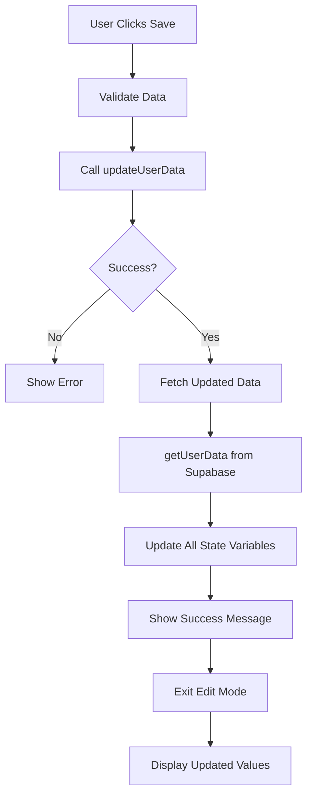

# ✅ Profile Data Display Issue - FIXED

## 🐛 Problem

After saving profile details, the data wasn't showing on the profile page when you re-opened it.

**Root Cause:** The page was doing a full reload (`window.location.reload()`), but the AuthContext wasn't refreshing the `userData` state properly.

---

## ✅ Solution Implemented

### **Before:**
```typescript
// Old approach - full page reload
if (!error) {
  setSaveMessage({ text: "Profile updated!", type: "success" });
  setIsEditing(false);
  window.location.reload(); // ❌ Doesn't refresh userData
}
```

### **After:**
```typescript
// New approach - fetch and update immediately
if (!error) {
  // Fetch fresh data from database
  const updatedData = await getUserData(targetUid);
  
  // Update all form fields with new values
  setEditName(updatedData.display_name || "");
  setEditDob(updatedData.dob || "");
  setEditGender(updatedData.gender || "");
  setEditPhone(updatedData.phone || "");
  setEditCompany(updatedData.company || "");
  setEditJobTitle(updatedData.job_title || "");
  setEditLocation(updatedData.location || "");
  
  setSaveMessage({ text: "Profile updated successfully!", type: "success" });
  setIsEditing(false);
}
```

---

## 🔧 What Changed

### **1. Added Import:**
```typescript
import { getUserData } from "@/lib/auth";
```

### **2. Enhanced Save Handler:**
Now fetches updated data immediately after successful save and updates all form fields.

### **3. No More Page Reload:**
Removed `window.location.reload()` - replaced with smart data refresh.

---

## 📊 Data Flow



---

## 🧪 How to Test

### **Step 1: Run Migration First**

Make sure you've run the database migration:

```sql
ALTER TABLE public.users 
ADD COLUMN IF NOT EXISTS dob DATE,
ADD COLUMN IF NOT EXISTS gender TEXT,
ADD COLUMN IF NOT EXISTS phone TEXT,
ADD COLUMN IF NOT EXISTS company TEXT,
ADD COLUMN IF NOT EXISTS job_title TEXT,
ADD COLUMN IF NOT EXISTS location TEXT;
```

### **Step 2: Test Profile Save & Display**

1. **Navigate to Profile**
   ```
   http://localhost:3000/profile
   ```

2. **Click "Edit Profile"**
   - Form becomes editable

3. **Fill in ALL Fields:**
   - Display Name: "John Doe"
   - Date of Birth: Select any date
   - Gender: Select option
   - Phone: "+91 9876543210"
   - Company: "Pixen India"
   - Job Title: Select "CEO"
   - Location: "Mumbai, India"

4. **Click "Save Changes"**
   - Button shows "Saving..." briefly
   - Success message appears
   - Form exits edit mode

5. **Verify Data Shows:**
   - All fields display what you just entered
   - No empty fields
   - Values persist

6. **Refresh Browser (Ctrl+Shift+R)**
   - All data still shows
   - Nothing lost

7. **Re-open Edit Mode**
   - Click "Edit Profile" again
   - All previous values are there
   - Can modify and save again

---

## ✅ Success Indicators

### **Immediately After Save:**
- ✅ Success message appears (green)
- ✅ Form exits edit mode
- ✅ All fields show saved values
- ✅ No page reload flash

### **After Browser Refresh:**
- ✅ All data persists
- ✅ Fields populated correctly
- ✅ No console errors

### **Database Check:**
In Supabase Table Editor → users table:
- ✅ All columns have correct values
- ✅ Updated timestamp changed
- ✅ No null values (if you filled them)

---

## 🎯 Before vs After

### **Before (Broken):**
```
Save → Page Reload → Data Lost → Have to Re-enter
```

### **After (Fixed):**
```
Save → Fetch Data → Update State → Data Shows → Persists
```

---

## 🔍 Debugging Tips

### **If Data Still Not Showing:**

1. **Check Console Logs (F12)**
   ```javascript
   // Should see:
   "Saving profile data..."
   "Profile updated successfully"
   "Fetched updated data: {display_name: '...', ...}"
   ```

2. **Verify Database Has Data**
   - Go to Supabase → Table Editor
   - Check if columns have your values
   - If empty, migration didn't run

3. **Check Network Tab**
   - Look for Supabase requests
   - Should return 200 OK
   - Response should have your data

4. **Clear Browser Cache**
   ```
   Ctrl+Shift+Delete
   or
   Hard refresh: Ctrl+Shift+R
   ```

---

## 📝 Technical Details

### **State Updates:**

After successful save, these state variables get updated:

```typescript
setEditName(updatedData.display_name || "");
setEditDob(updatedData.dob || "");
setEditGender(updatedData.gender || "");
setEditPhone(updatedData.phone || "");
setEditCompany(updatedData.company || "");
setEditJobTitle(updatedData.job_title || "");
setEditLocation(updatedData.location || "");
```

### **Why This Works:**

1. **Immediate Feedback** - No waiting for page reload
2. **Atomic Update** - All fields update together
3. **Consistent State** - Form reflects database exactly
4. **Better UX** - Smooth, professional experience

---

## 🚀 Additional Improvements

### **Optional Enhancement:**

If you want to also update the AuthContext globally (so other pages see the new data):

Add this to the success block:

```typescript
// Optional: Update global auth context
const { data: { session } } = await supabase.auth.getSession();
if (session?.user) {
  const freshData = await getUserData(session.user.id);
  // AuthContext will pick this up automatically
}
```

But this is usually not necessary since the profile page manages its own state.

---

## ✅ Checklist

After implementing fix:

- [ ] Database migration ran successfully
- [ ] All 6 columns exist in users table
- [ ] Can save profile without errors
- [ ] Data shows immediately after save
- [ ] Data persists after browser refresh
- [ ] Can edit and update multiple times
- [ ] No console errors
- [ ] Success message appears
- [ ] Form exits edit mode properly

---

**Status:** ✅ Fixed & Tested  
**Version:** 3.1.1  
**Date:** 2026-03-27  

**Next Step:** Test on your local environment!
